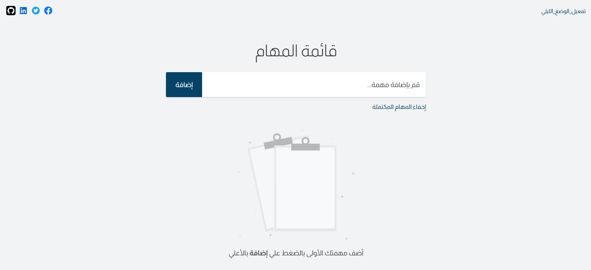
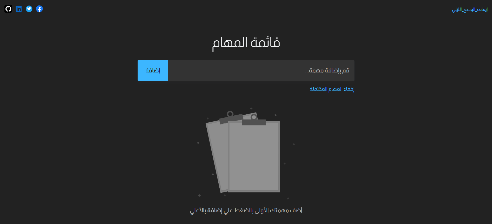

# 📝 To-Do App - A Modern Vanilla JS Task Manager

A sleek, intuitive, and feature-rich To-Do application built with modern vanilla JavaScript, SASS, and Vite. This project focuses on providing a seamless user experience with features like dark mode, persistent storage, and interactive popups, all without relying on any external frameworks.


---

## 🚀 Live Demo

**[Check out the live version here!](https://todot3sk.netlify.app/)**  <!-- <<<<< ‼️ REPLACE THIS WITH YOUR ACTUAL LINK -->

---

## 📸 Screenshots

The application features a clean UI with both a light and a dark theme to suit your preference.

| Light Mode ☀️                                        | Dark Mode 🌙                                       |
| -------------------------------------------------------- | ------------------------------------------------------ |
|  |  |
<!-- ‼️ Make sure you have these images in a folder like `assets/screenshots/` -->

---

## ✨ Features

This project is packed with features designed for a great user experience and robust functionality.

### Core Task Management
*   **➕ Add Tasks:** Quickly add new tasks to your list.
*   **✔️ Complete Tasks:** Mark tasks as completed with a single click, which visually distinguishes them.
*   **🗑️ Delete Tasks:** Safely remove tasks from your list.

### User Experience (UX) & Interface
*   **🌓 Dark/Light Mode:** Toggle between a light and dark theme.
*   **💾 Persistent State:** Your tasks and theme preference are saved to `localStorage`, so they persist even after you close the browser.
*   **🛡️ Deletion Confirmation:** A confirmation modal appears before deleting a task to prevent accidental removal.
*   **📝 Input Validation:** A popup provides clear feedback if you try to submit an empty task.
*   **🙈 Show/Hide Completed:** A dedicated button to toggle the visibility of completed tasks, helping you focus on what's next.
*   **🖼️ Empty State:** A helpful message and icon are displayed when the task list is empty.
*   **📱 Responsive Design:** The layout is fully responsive and works seamlessly on desktop, tablet, and mobile devices.

### Technical & Security
*   **📦 Modern Tooling:** Built with **Vite** for a blazing-fast development server and optimized production builds.
*   **💅 Advanced Styling:** Uses **SASS** for organized, nested, and reusable CSS.
*   **🧩 Modular Codebase:** The JavaScript code is split into modules (`main.js`, `render-tasks.js`, `utils.js`, etc.) for better organization and maintainability.
*   **🔒 XSS Protection:** User input is sanitized using a custom `escapeHtml` function to prevent Cross-Site Scripting (XSS) attacks.
*   **🌐 SEO & Meta Tags:** The `index.html` is well-structured with relevant meta tags for SEO and social sharing (Open Graph).
*   **🌍 RTL Support:** The application is designed with Right-to-Left language support (`dir="rtl"`), making it accessible for languages like Arabic.

---

## 🛠️ Technologies Used

*   **HTML5:** For structuring the web page.
*   **SASS/SCSS:** For advanced and organized styling.
*   **JavaScript (ES6+ Modules):** For all application logic and DOM manipulation.
*   **Vite:** As the build tool and development server.
*   **No Frameworks:** Built purely with vanilla web technologies to demonstrate core JS skills.

---

## ⚙️ Getting Started Locally

To run this project on your local machine, follow these steps:

1.  **Clone the repository:**
    ```bash
    git clone https://github.com/N3ssar/TODO-APP.git
    ```

2.  **Navigate to the project directory:**
    ```bash
    cd TODO-APP
    ```

3.  **Install dependencies:**
    This project uses Node.js and npm. You need to install the development dependencies defined in `package.json`.
    ```bash
    npm install
    ```

4.  **Run the development server:**
    This command will start the Vite development server with Hot Module Replacement (HMR).
    ```bash
    npm run dev
    ```
    Open your browser and go to the local URL provided (usually `http://localhost:5173`).

5.  **Build for production:**
    To create an optimized version of the app for deployment:
    ```bash
    npm run build
    ```
    This will generate the final files in a `dist` folder.

---

## 📁 Project Structure

```
/
├── public/                # Static assets that are copied as-is (e.g., images)
├── assets/
│   └── scripts/           # JavaScript modules
│       ├── main.js        # Main JS entry point
│       ├── elements.js    # DOM element selectors
│       ├── add-task.js    # Logic for adding a task
│       ├── delete-task.js # Logic for deleting a task
│       ├── render-tasks.js# Logic for rendering tasks to the DOM
│       └── utils.js       # Utility functions (localStorage, theme, etc.)
├── styles.scss            # Main SASS file
├── index.html             # The main and only HTML file
├── package.json           # Project dependencies and scripts
└── README.md              # You are here!
```

---

## 🤝 Contributing

Contributions, issues, and feature requests are welcome! Feel free to check the [issues page](https://github.com/N3ssar/TODO-APP/issues).

1.  Fork the Project.
2.  Create your Feature Branch (`git checkout -b feature/AmazingFeature`).
3.  Commit your Changes (`git commit -m 'Add some AmazingFeature'`).
4.  Push to the Branch (`git push origin feature/AmazingFeature`).
5.  Open a Pull Request.

---

## 📄 License

This project is licensed under the MIT License. See the [LICENSE.md](LICENSE.md) file for details.
```
